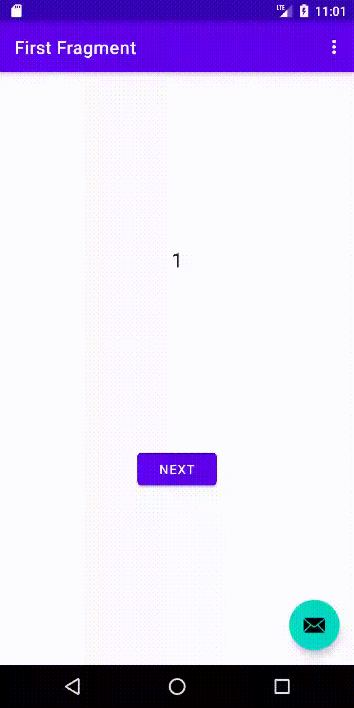

# Counter app

This app is a simple demonstration of some functionalities of android development. It allows to move
to other view and has a counter function. Every time that the floating button is clicked, the
counter value is multiplied by 2

